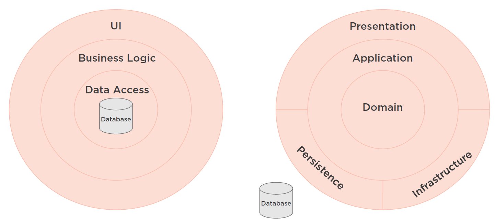

[Clean Architecture: Patterns, Practices, and Principles | Pluralsight](https://app.pluralsight.com/library/courses/clean-architecture-patterns-practices-principles/table-of-contents)

# Database Centric vs Domain Centric Architecture

# Hexagonal Architecture

# Onion Architecture

# The Clean Architecture

# Classic Three-layer Architecture

# Modern Four-layer Architecture

# Layer Dependencies

# Layer Examples

