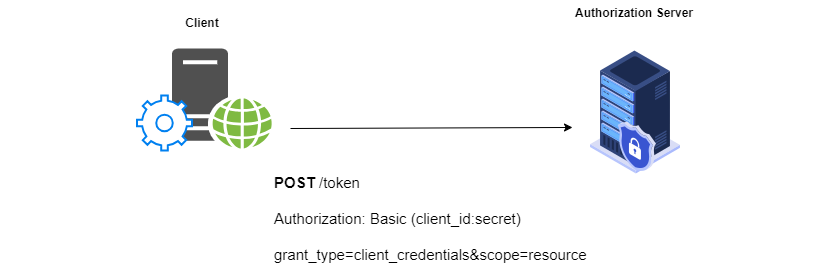

[*(open on draw.io)*](https://app.diagrams.net/#Uhttps%3A%2F%2Fraw.githubusercontent.com%2Fphongnguyend%2FPractical.CleanArchitecture%2Fmaster%2Fdocs%2FOAuth%25202.0%2Foauth.drawio)

# OAuth 2.0

# OAuth2 Flows:
### Redirect Flows:
- Authorization Code Flow
- Implicit Flow
### Credential Flows:
- Resource Owner Password Credentials Flow
- Client Credentials Flow

# 1. Authorization Code Flow:

## 1.1. Authorization Code Flow (Web Application Clients)
.png)

## 1.2. Authorization Code Flow (Authorization Request)
.png)

## 1.3. Authorization Code Flow (Authorization Response)
.png)

## 1.4. Authorization Code Flow (Token Request)
.png)

## 1.5. Authorization Code Flow (Token Response)
.png)

## 1.6. Authorization Code Flow (Resource Access)
.png)

## 1.7. Authorization Code Flow (Refreshing the Token)
.png)

# 2. Implicit Flow:

## 2.1. Implicit Flow (Native / Local Clients)
.png)

## 2.2. Implicit Flow (Authorization Request)
.png)

## 2.3. Implicit Flow (Token Response)
.png)

## 2.4. Implicit Flow (Resource Access)
.png)

# 3. Resource Owner Password Credentials:

## 3.1 Resource Owner Password Credentials (Trusted Application)
.png)

## 3.2. Resource Owner Password Credentials (Token Request)
.png)

## 3.3. Resource Owner Password Credentials (Token Response)
.png)

## 3.4. Resource Owner Password Credentials (Resource Access)
.png)

# 4. Client Credentials Flow (No human involved at all):

